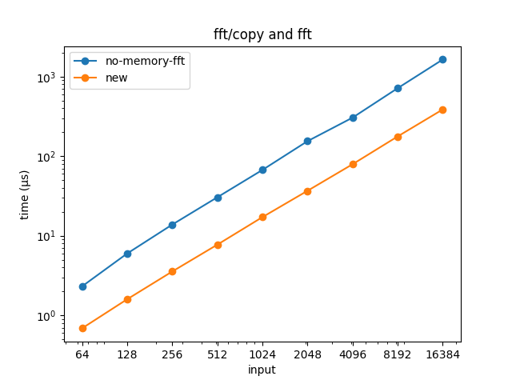
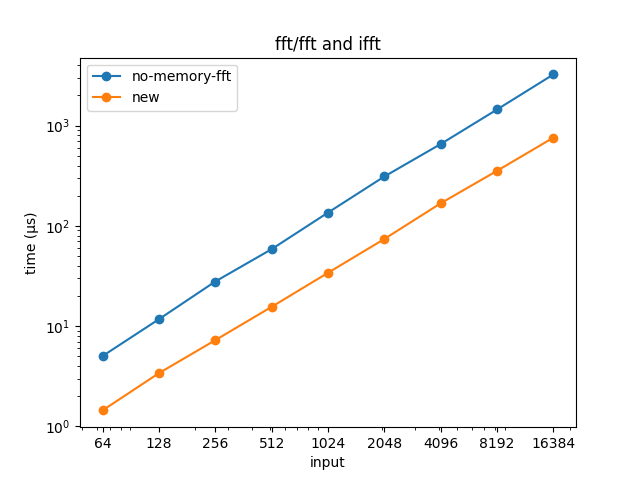
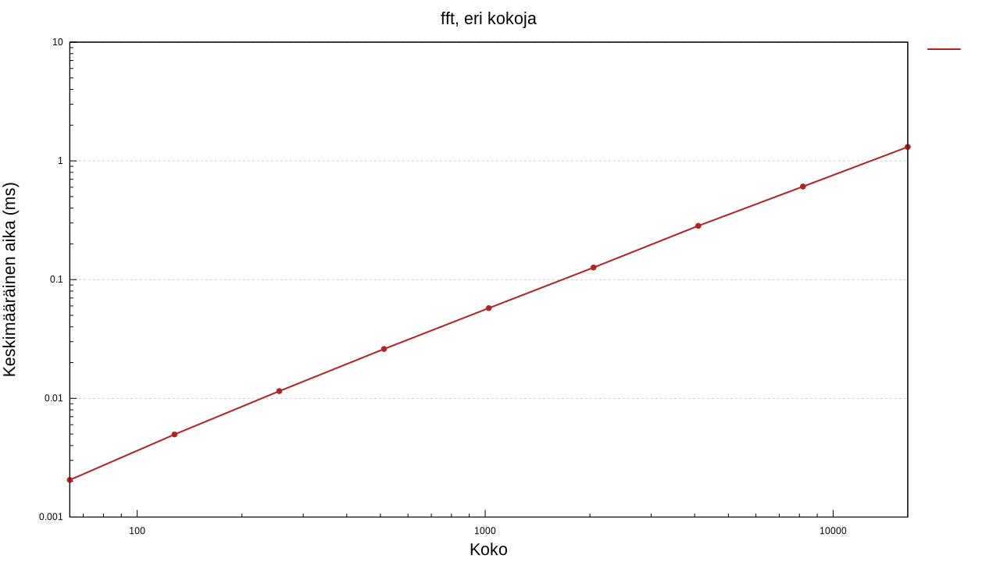

# Äänen taajuuden seuraus

### Suorituskykytestaus

Suorituskykytestaus tehdään käyttäen Criterion-kirjastoa. Se suorittaa määriteltyä
testiä useaan kertaan ja tekee jonkin verran tilastollista analyysiä.

Jotkin kuvaajat on koostettu Python-skriptien (matplotlib) avulla, jotka löytyvät `suorituskyky`-hakemiston alta.

Kaikki suorituskykytestit voidaan ajaa siirtymällä hakemiston `suorituskyky`, ja ajamalla

```
cargo bench
```

Tulokset kootaan kansioon `suorituskyky/target/criterion/`.

#### [FFT](/suorituskyky/benches/fft_performance.rs)

FFT:lle on kirjoitettu kaksi erilaista suorituskykytestiä.

Molemmissa aloitetaan kokoamalla satunnaisia kompleksilukuja taulukkoon
(molemmat komponentit välillä `[-1, 1]`) ja toistamalla sitten Fourier-muunnosta
tälle taulukolle.

Molemmat testit suoritetaan erikseen kaikilla taulukon koilla, jotka ovat kahden potensseja välillä 64...16384.

##### copy and fft

Tässä versiossa, ennen jokaista toistoa, taulukko on kopioidaan alkuperäisestä uudestaan,
koska FFT-toteutus ylikirjoittaa taulukon. Tämä vaikuttaa hieman mitattuun suoritusaikaan. 

##### fft and ifft

Tässä versiossa taulukko palautetaan ennalleen suorittamalla käänteismuunnos. Samalla testataan
käänteismuunnoksen suorituskykyä - ideaalitapauksessa se ei ole juurikaan hitaampi kuin varsinainen
muunnos.

*sijoita lopulliset tulokset tähän*

#### Twiddle-kertoimien optimointi

Toteutin commitissa [`c61e5f`](https://github.com/ollpu/tiralabra/commit/c61e5fa048774b5c045c3f6e9a0a6dd175942291) FFT-
algoritmiin optimoinnin, jossa esilasketaan sini- ja kosinifunktioita käyttävät kertoimet. Suorituskykytesti
ei ota esilaskentaa huomioon, sillä normaalissa käytössä esilaskenta tehdään uudestaan vain harvoin.
Alla molempien suorituskykytestien tulokset ennen ("no-memory-fft") ja jälkeen ("new"). Kaikilla
koilla ja molemmissa testeissä algoritmi nopeutui noin 70 %.




Keskimääräiset suoritusajat (ennen (µs); jälkeen (µs); muutos):

| koko  | copy-and-fft | fft-and-ifft |
| ----- | ------------ | ------------ |
| 64    | 2,310; 0,686; 70,3 %      | 5,029; 1,443; 71,3 % |
| 128   | 5,976; 1,590; 73,4 %      | 11,720; 3,394; 71,0 % |
| 256   | 13,801; 3,551; 74,3 %     | 27,852; 7,241; 74,0 % |
| 512   | 30,424; 7,723; 74,6 %     | 58,561; 15,565; 73,4 % |
| 1024  | 67,111; 17,133; 74,5 %    | 135,618; 34,036; 74,9 % |
| 2048  | 154,358; 36,706; 76,2 %   | 310,813; 73,967; 76,2 % |
| 4096  | 304,969; 79,201; 74,0 %   | 655,241; 168,102; 74,3 % |
| 8192  | 715,034; 177,009; 75,2 %  | 1449,134; 354,259; 75,6 % |
| 16384 | 1638,992; 386,527; 76,4 % | 3242,291; 759,725; 76,6 % |

#### Vanha kuvaaja


