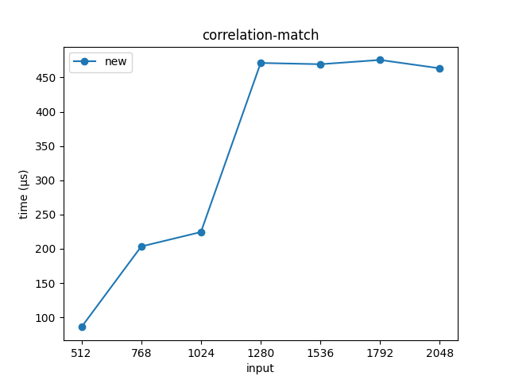

# Äänen taajuuden seuraus

## Yksikkö- / integraatiotestaus

Kaikki automaattitestit voidaan suorittaa ajamalla

```
cargo test --no-default-features
```

Toteutukset löytyvät hakemistosta [src/test](/src/test).

Tässä on eritelty pääkomponenttien olennaisimmat testit:

- FFT
  - [fft_ifft_results_in_original](/src/test/test_fft.rs#L6)

    Kovakoodatulle taulukolle tehdään ensin FFT, ja sitten IFFT, eli
    käänteismuunnos.  Lopputuloksen tulisi olla likimain sama, kuin
    alkuperäinen taulukko. Tämä tarkistetaan kuuden desimaalin tarkkuudella.

  - [fft_unit_impulse](/src/test/test_fft.rs#L25)

    Otetaan diskreetti Fourier-muunnos taulukosta, jossa indeksissä `1` on luku
    `1`, muualla nolla. Tuloksen jokaisessa alkiossa on oltava kompleksiluku,
    jonka itseisarvo on `1`, ja argumentti indeksin mukainen. Tulos tarkistetaan
    kuuden desimaalin tarkkuudella.

  - [fft_random](/src/test/test_fft.rs#L38)

    Kovakoodattu syöte ja tulos, joka tarkistetaan kuuden desimaalin tarkkuudella.
- Ristikorrelaatio
  - [simple_cross_correlation](/src/test/test_cross_correlation.rs#L5)

    Kovakoodatut taulukot ja oikea vastaus. Tarkistetaan kuuden desimaalin tarkkuudella.
  - [cross_correlation_both_max_size](/src/test/test_cross_correlation.rs#L27)

    Kovakoodatut taulukot, jotka ovat molemmat saman kahden potenssin pituisia. Testi pyrkii
    varmistamaan, ettei tulos "vuoda ympäri".
- Korrelaatiotäsmäys
  - [random_correlation_match](/src/test/test_correlation_match.rs#L23)

    Syötteenä on taulukko A (deterministisiä) satunnaislukuja. Tästä valitaan
    neljäsosa sattumanvaraisesta kohdasta taulukoksi B. Tuloksesta tarkistetaan,
    että algoritmi löytää oikean kohdan noin yhden näytteen tarkkuudella.
  - [correlation_match_subsample_accuracy](/src/test/test_correlation_match.rs#L39)

    Taulukossa A on siniaalto, ja taulukossa B epäkokonaisluvun verran siirretty
    siniaalto. Algoritmin tulee löytää tämä siirrosmäärä kahden desimaalin tarkkuudella.
  - [correlation_match_period](/src/test/test_correlation_match.rs#L54)

    Taulukoissa A ja B on siniaalto tietyllä jaksonajalla. Algoritmin tulee löytää oikea
    jakso kahden desimaalin tarkkuudella.

## Manuaalinen oikeellisuustestaus

Nämä testit tehdään demo-ohjelmaa käyttäen. Se tulee käynnistää valmiista binääristä
tai seuraavasti:

```
cargo run --release --example demo
```

**Huom:** Varmista terminaalin tulostuksesta, että näytteenottotaajuus on `44100
Hz`. Testisyötteestä mitatut taajuuslukemat ovat eri, jos näin ei ole.

```
...
Näytteenottotaajuus: 44100
```

### Vakautuksen toimivuus

- Valitse äänilähteeksi "Testi: Vaihtuva". Tällöin syötteenä on taajuudeltaan
vaihteleva siniaalto.
- Aseta "Vakauta"-valinta päälle, ja siirrä "Näytön vaimenemisaika" sekä "Muistin vaimenemisaika"
  -liu'ut nollaan.
  
- Taajuuden vaihdellessa aaltomuodon tulisi pysyä "keskellä", eli se skaalautuu sivusuunnassa
  isommaksi ja pienemmäksi, mutta keskikohta pysyy paikoillaan.
  - *Väärä toiminta:* Yhdessä vaiheessa algoritmille määriteltiin painofunktio virheellisesti
    siten, että sen vasen puoli oli kokonaan nollaa. Tällöin skaalauksen keskikohta ei
    ollut keskellä, vaan jonkin verran oikella.

### Vakautuksen tarkkuus ja taajuusarvio

- Valitse äänilähteeksi "Testi: Siniaalto". Tällöin syötteenä on vakiotaajuuksinen
  siniaalto.
- Aseta "Vakauta"-valinta päälle, ja siirrä "Näytön vaimenemisaika" sekä "Muistin vaimenemisaika"
  -liu'ut nollaan.
  
- Aaltomuodon tulisi pysyä silmämääräisesti paikoillaan (reunoja lukuun ottamatta).
  - *Väärä toiminta:* Jos aaltomuotoa piirrettäessä ei oteta "ylijäämää" (`residual`), eli
    näytteenottoväliä tarkempaa tulosta huomioon,
    ```rs
    .map(|(i, v)| (x + w / M as f32 * (i as f32 /*- residual*/), y + h / 2. - v * h / 2.));
    ```
    niin aaltomuoto ei enää pysy silmämääräisesti paikoillaan.
- Syötteen taajuus on [`216.2747907 Hz`](/examples/test_signal/mod.rs#L4). Siispä
  taajuusarvion tulisi olla sama ainakin yhden desimaalin tarkkuudella.
  - *Väärä toiminta:* Jos jaksonajan arvio otettaisiin vain näytteenottovälin tarkkuudella,
    olisi taajuusarvion tarkkuus vain noin puoli hertsiä.

## Suorituskykytestaus

Suorituskykytestaus tehdään käyttäen Criterion-kirjastoa. Se suorittaa määriteltyä
testiä useaan kertaan ja tekee jonkin verran tilastollista analyysiä.

Jotkin kuvaajat on koostettu Python-skriptien (matplotlib) avulla, jotka löytyvät `suorituskyky`-hakemiston alta.

Kaikki suorituskykytestit voidaan ajaa siirtymällä hakemiston `suorituskyky`, ja ajamalla

```
cargo bench
```

Tulokset kootaan kansioon `suorituskyky/target/criterion/` selattavaan HTML-muotoon.

### [FFT](/suorituskyky/benches/fft_performance.rs)

```
cargo bench --bench fft_performance
```

FFT:lle on kirjoitettu kaksi erilaista suorituskykytestiä.

Molemmissa aloitetaan kokoamalla satunnaisia kompleksilukuja taulukkoon
(molemmat komponentit välillä `[-1, 1]`) ja toistamalla sitten
Fourier-muunnosta tälle taulukolle.

Molemmat testit suoritetaan erikseen kaikilla taulukon koilla, jotka ovat
kahden potensseja välillä 64...16384.

#### copy and fft

Tässä versiossa, ennen jokaista toistoa, taulukko kopioidaan alkuperäisestä
uudestaan, koska FFT-toteutus ylikirjoittaa taulukon. Tämä vaikuttaa hieman
mitattuun suoritusaikaan. 

#### fft and ifft

Tässä versiossa taulukko palautetaan ennalleen suorittamalla myös
käänteismuunnos. Samalla testataan käänteismuunnoksen suorituskykyä -
ideaalitapauksessa se ei ole juurikaan hitaampi kuin varsinainen muunnos.

#### Twiddle-kertoimien optimointi

Toteutin commitissa
[`c61e5f`](https://github.com/ollpu/tiralabra/commit/c61e5fa048774b5c045c3f6e9a0a6dd175942291)
FFT-algoritmiin optimoinnin, jossa esilasketaan sini- ja kosinifunktioita
käyttävät kertoimet. Suorituskykytesti ei ota esilaskentaa huomioon, sillä
normaalissa käytössä esilaskenta tehdään uudestaan vain harvoin.  Alla
molempien suorituskykytestien tulokset ennen ("no-memory-fft") ja jälkeen
("new"). Kaikilla koilla ja molemmissa testeissä algoritmi nopeutui noin 70 %.


Keskimääräiset suoritusajat (ennen (µs); jälkeen (µs); muutos):

| koko  | copy-and-fft | fft-and-ifft |
| ----- | ------------ | ------------ |
| 64    | 2,310; 0,686; 70,3 %      | 5,029; 1,443; 71,3 % |
| 128   | 5,976; 1,590; 73,4 %      | 11,720; 3,394; 71,0 % |
| 256   | 13,801; 3,551; 74,3 %     | 27,852; 7,241; 74,0 % |
| 512   | 30,424; 7,723; 74,6 %     | 58,561; 15,565; 73,4 % |
| 1024  | 67,111; 17,133; 74,5 %    | 135,618; 34,036; 74,9 % |
| 2048  | 154,358; 36,706; 76,2 %   | 310,813; 73,967; 76,2 % |
| 4096  | 304,969; 79,201; 74,0 %   | 655,241; 168,102; 74,3 % |
| 8192  | 715,034; 177,009; 75,2 %  | 1449,134; 354,259; 75,6 % |
| 16384 | 1638,992; 386,527; 76,4 % | 3242,291; 759,725; 76,6 % |

Algorimtin aikavaativuus on teoriassa `O(n log n)`. Logaritmikerroin ei kuitenkaan ole
ilmeinen log-log-kuvaajassa. Alla testien keskimääräiset suoritusajat uusimmalla
toteutuksella, suhteutettuna kokoon. Yksikkö on nanosekunti.

| koko  | copy-and-fft | fft-and-ifft |
| ----- | ------------ | ------------ |
| 64    | 10,719       | 22,547       |
| 128   | 12,422       | 26,516       |
| 256   | 13,871       | 28,285       |
| 512   | 15,084       | 30,400       |
| 1024  | 16,731       | 33,238       |
| 2048  | 17,923       | 36,117       |
| 4096  | 19,336       | 41,041       |
| 8192  | 21,608       | 43,245       |
| 16384 | 23,592       | 46,370       |

### [Korrelaatiotäsmäys](/suorituskyky/benches/correlation_match_performance.rs)

```
cargo bench --bench correlation_match_performance
```

Korrelaatiotäsmäyksen suorituskykyä testataan (deterministisillä) satunnaisluvuilla.
Taulukossa A on kokoparametrin verran satunnaislukuja välillä `[0, 1]`. Taulukoksi
B valitaan tästä satunnainen osa, jonka pituus on puolet.

Testi suoritetaan erikseen koilla `512, 768, 1024, 1280, 1536, 1792, 2048`.



Keskimääräiset suoritusajat (µs):

| koko | correlation-match |
| ---- | ----------------- |
| 512  | 85,898  |
| 768  | 203,418 |
| 1024 | 224,487 |
| 1280 | 471,113 | 
| 1536 | 469,268 |
| 1792 | 475,502 |
| 2048 | 463,295 |

Toteutettu FFT-algoritmi toimii vain koilla, jotka ovat kahden potensseja.
Siispä korrelaatiotäsmäys hidastuu merkittävästi aina, kun ylitetään kahden potenssi.

Korrelaatiotäsmäyksessä tehtävän FFT:n on oltava kooltaan kaksinkertainen syötteen
kokoon nähden. Algoritmin aikana tehdään kaksi muunnos-käänteismuunnos-paria.

`fft-and-ifft`-testistä koon `4096` suoritusaika kaksinkertaistettuna, eli

```
168,102 * 2 = 336,204
```

on samaa kokoluokkaa kuin koon `2048` korrelaatiotäsmäyksen suoritusaika.
Voidaan tehdä johtopäätös, että FFT on algoritmin pullonkaula.
